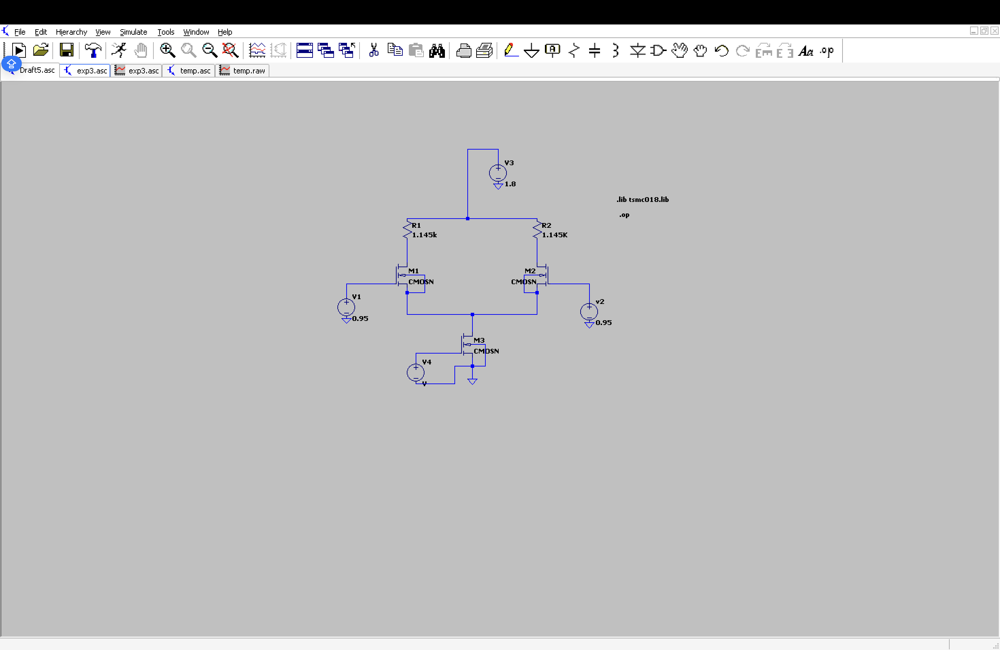

# Lic-Lab
## Lic 
##                                   1.   Differential Amplifier with Resistor RSS

**Analysis**

The differential amplifier is designed with these values:

VDD = 1.8 V , Power ≤ 2.2 mW , ViCM = 0.95 V , VOCM = 1.1 V , Vp = 0.4 V

We perform DC, transient, and frequency analysis while extracting circuit parameters.

Given:

**Power Calculation:**

 P = VDD x ISS = 1.8 x ISS

 ISS = 2.2 mW / 1.8 V = 1.222 mA

 ID1 = ID2 = ISS/2 = 0.611 mA

 **Resistance Values:**

 RD = (VDD - VOCM)/ID1 = (1.8 – 1.1) / 0.611mA = 1.145 kΩ

 RSS = Vp / ISS = 0.4 V / 1.222 mA = 327.33 Ω

 Thus, we have:

 RD1 = RD2 = 1.145 kΩ

 RSS = 327.33 Ω
 
**Components Required**

 Voltage Supplies: DC (0.95 V), AC

 MOSFETs: 2 N-channel MOSFETs

 Resistors: (1.145 kΩ x2, 327 Ω)

 MOSFET Parameters: W = 108.5 µm, L = 180 nm

 
 
 **DC Analysis**
 
 To check if the MOSFETs are in saturation mode, we use:

VGD = (0.95 – 1.1) V = -0.15 V

Vth = 0.3966 V
Since VGD is negative and Vth is positive, the MOSFET operates in saturation mode and can function as an amplifier. The DC analysis confirms that VD1 = VD2 = 1.10023 V, ID1 = ID2 = 0.611154 mA, ISS = 1.22231 mA, which match our calculations.

Power is verified as:

P = VDD.ISS = 1.8 V x 1.22231 mA = 2.200158 mW, which meets the power requirement.

In LTspice, I set up the circuit by placing the MOSFETs and adding the power supply, resistors, and current source. Then, I ran a DC operating point analysis to check the voltages and currents at different nodes, confirming that the MOSFETs were in the right region.This is the result we got.

 

 
**Transient Analysis**

An AC signal is applied to only one MOSFET (M1) with:

Vpeak: 50 mV

Frequency: 1 kHz

DC offset: 0.95 V

The simulation shows a 180° phase shift, meaning the output (VD1) is inverted compared to the input (VGS). The voltage gain is calculated as:

Av = (1.357 – 0.826) / (0.999-0.900) = 5.36 V/V

A’v = 20log10(5.36) = 14.583 dB

In LTspice, I configured the AC voltage source for the transient analysis and plotted the input and output waveforms. The output waveform showed the expected phase shift and amplification. 

AC Analysis

For small-signal analysis, an AC amplitude of 1V is used. The simulation shows:

Midband gain = 14.753 dB

Phase shift = 179.99°

Bandwidth ≈ 2.7 GHz

In LTspice, I ran an AC sweep analysis from 1 Hz to 1 THz, generating a frequency response plot. This allowed me to check the gain and phase shift at different frequencies.

## 2. Differential Amplifier with Current Source ISS

DC Analysis

Replacing RSS with a current source ISS improves stability. The calculated values are:

VD1 = VD2 = 1.1004 V

ID1 = ID2 = 0.611 mA

ISS = 1.222 mA

Power is verified as:

P = VDD.ISS = 1.8 V x 1.222 mA = 2.1996 mW ≈ 2.2 mW

Transient Analysis

Applying the same sinusoidal input, the gain is:

Av = (1.1 – 0.87078) / 50mV = 4.5844 V/V

A’v = 20log10(4.5844) = 13.2256 dB

AC Analysis

Midband gain = 13.574 dB

Bandwidth ≈ 2.16 GHz

## 3.Differential Amplifier with NMOS Current Source

Instead of using a separate current source, an NMOS transistor (M3) is used. The values obtained are:

VG (M3) = 0.600 V

ISS = 1.222 mA

Power = 2.200068 mW

Transient Analysis

Av = (1.337-0.859)/ (0.999-0.900)V = 4.82 V/V

A’v = 20log10(4.82) = 13.66 dB

AC Analysis

Midband gain = 13.82 dB

Bandwidth ≈ 2.142 GHz

Result

The ISS configuration improved circuit stability and matched expected values.

The NMOS current source gave the highest gain but showed some instability.

The AC analysis showed the highest bandwidth in the RSS configuration but better gain in the NMOS version.

Conclusion

The RSS circuit is simple but can be affected by temperature. The ISS configuration offers more stable operation, while the NMOS configuration provides the highest gain. Depending on the requirement (stability vs. gain), each design has its advantages.

Inference

The differential amplifier plays a critical role in op-amp design by rejecting noise and amplifying differences. Using LTspice, I confirmed how different configurations affect gain and stability. The NMOS configuration had the best gain, but the ISS design was more stable, making it more suitable for real-world applications.

